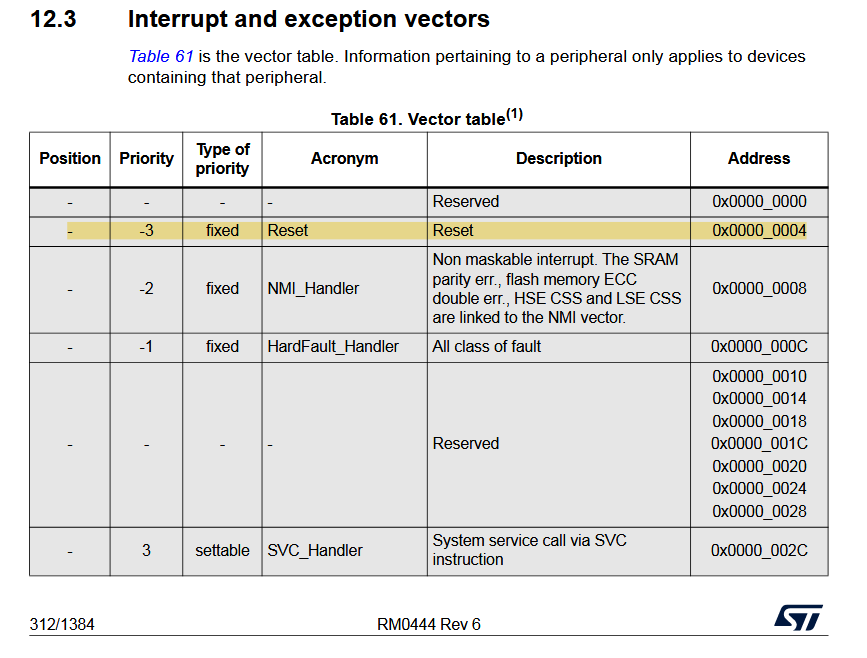
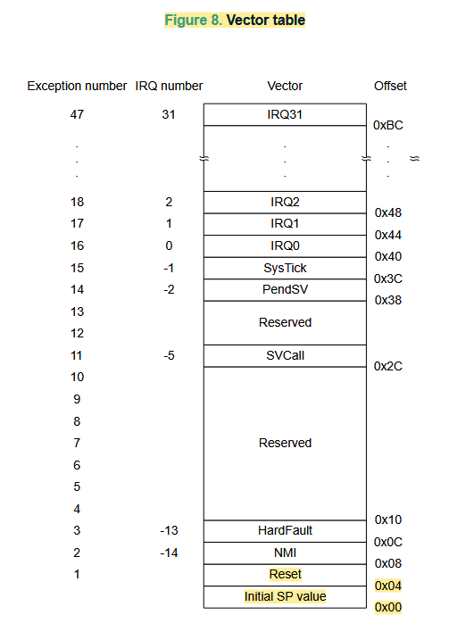

# Talk to Metal 1
Trying to talk to metal. In this repository I followed along some resources (mainly this video: https://youtu.be/MhOba73z-dQ?si=HusY9U2iEcaexpgS) to try learn what happens before `int main()` in microcontrollers.

Here I write a linker script and startup code for the `STM32G071RB` and test it on my Nucleo board.

# Installation
Make sure to get the following VS Code extension: https://marketplace.visualstudio.com/items?itemName=marus25.cortex-debug

Make sure to get the following stuff:

```sh
sudo apt install gcc-arm-none-eabi
sudo apt install openocd gdb-multiarch
```

# Setting Up VS Code
Make sure to set up your `launch.json` a as per below:

Configure it to be like this:
```sh
"breakAfterReset": true,
            "device": "stm32g0",
            "servertype": "openocd",
            "gdbPath": "gdb-multiarch",
            "configFiles": [
                "interface/stlink.cfg",
                "target/stm32g0x.cfg"
            ],
```

Where `breakAfterReset` ensures we can debug prior to `main()` function. Whilst the remainder configures the debugger to use `openocd` as the flasher and which type of device to target (in this case we are programming an `STM32G071RB`).

For `executable`, edit based on which `src_x` you are running, for example if we are running `src_4`:
```sh
 "executable": "${workspaceFolder}/src_4_bare_example/main.elf",
 ```

Same with  `preLaunchCommands`:
```sh
"preLaunchCommands": [
                "monitor program ${workspaceFolder}/src_4_bare_example/main.elf verify reset"
            ],
```

For both of the above, also make sure you are targetting the correct executable file.

# Commands
I should probably make a `Makefile` to handle these things, but so far, below are the main commands you need to use.

Utilities for inspecting size and disassembly:
```sh
arm-none-eabi-size main.elf
arm-none-eabi-objdump -D main.elf | less
```

Compile minimal C program:
```sh
arm-none-eabi-gcc -mcpu=cortex-m0 -mthumb -std=c11 -g -O0 -c main.c -o main.o
```

Link with default behaviour of toolchain including default standard C library, startfiles and linker script. Insert empty stubs (nosys.specs) for Newlib's system calls:
```sh
arm-none-eabi-gcc --specs=nosys.specs main.o -o main.elf
```

Link without the default libc, startfiles, and linker script:
```sh
arm-none-eabi-gcc -nolibc -nostartfiles -T empty.ld -Wl,--verbose main.o -o main.elf
```

Compile a custom startup file and link with custom linker script:
```sh
arm-none-eabi-gcc -mcpu=cortex-m0 -mthumb -std=c11 -g -O0 -c main.c -o main.o
arm-none-eabi-gcc -mcpu=cortex-m0 -mthumb -std=c11 -g -O0 -c startup.c -o startup.o
arm-none-eabi-gcc -nolibc -nostartfiles -T linker_script.ld main.o startup.o -o main.elf
```

# Some Theory
- CPU's start executing at a fixed address
    - At startup the Program Register (PC) is initialised with the reset vector the pointer to the first instruction the CPU will execute
    - For ARM the PC register is the 2nd value of the Interrupt Vecotr Table 





# Purpose of Startup
1. Hardware init (Load Program Counter and Stack Pointer)
2. System init
3. C runtime init (CRT0)
    - Init data variables
    - Clear bss variables
4. __libc_init_array
5. main()
6. while(1);