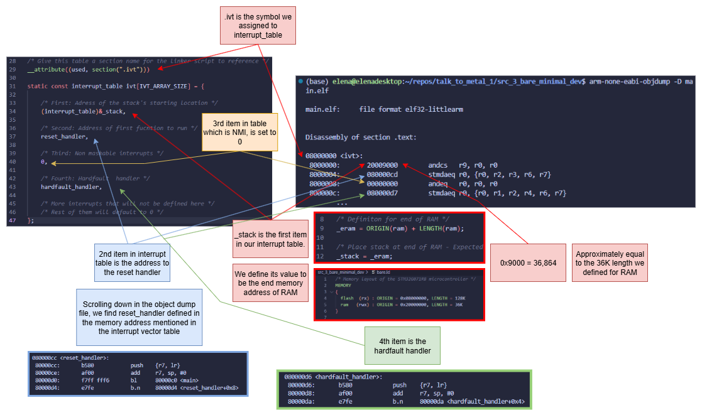

# 3 Bare Minimal Empty Dev
Starting development of startup code and linker script from a clean linker/compiler slate that was created in `src_2_...`

Compile the startup file:
```sh
arm-none-eabi-gcc -mcpu=cortex-m0 -mthumb -std=c11 -g -O0 -c startup.c -o startup.o
```

Link the executable using our custom startup file and custom linker script:
```sh
arm-none-eabi-gcc -nolibc -nostartfiles -T bare.ld main.o startup.o -o main.elf
```

We use object dump to see if the sections were placed were we said for them to be placed:
```sh
(base) elena@elenadesktop:~/repos/talk_to_metal_1/src_3_bare_minimal_dev$ arm-none-eabi-objdump -D main.elf 

main.elf:     file format elf32-littlearm


Disassembly of section .text:

08000000 <ivt>:
 8000000:       20009000        andcs   r9, r0, r0
 8000004:       080000cd        stmdaeq r0, {r0, r2, r3, r6, r7}
 8000008:       00000000        andeq   r0, r0, r0
 800000c:       080000d7        stmdaeq r0, {r0, r1, r2, r4, r6, r7}
        ...

080000c0 <main>:
 80000c0:       b580            push    {r7, lr}
 80000c2:       af00            add     r7, sp, #0
 80000c4:       2300            movs    r3, #0
 80000c6:       0018            movs    r0, r3
 80000c8:       46bd            mov     sp, r7
 80000ca:       bd80            pop     {r7, pc}

080000cc <reset_handler>:
 80000cc:       b580            push    {r7, lr}
 80000ce:       af00            add     r7, sp, #0
 80000d0:       f7ff fff6       bl      80000c0 <main>
 80000d4:       e7fe            b.n     80000d4 <reset_handler+0x8>

080000d6 <hardfault_handler>:
 80000d6:       b580            push    {r7, lr}
 80000d8:       af00            add     r7, sp, #0
 80000da:       e7fe            b.n     80000da <hardfault_handler+0x4>

Disassembly of section .debug_info:

00000000 <.debug_info>:
   0:   0000003f        andeq   r0, r0, pc, lsr r0
   4:   00000004        andeq   r0, r0, r4
   8:   01040000        mrseq   r0, (UNDEF: 4)
   c:   00000047        andeq   r0, r0, r7, asr #32
  10:   0000000c        andeq   r0, r0, ip
  14:   00000700        andeq   r0, r0, r0, lsl #14
  18:   0000c000        andeq   ip, r0, r0
  1c:   00000c08        andeq   r0, r0, r8, lsl #24
  20:   00000000        andeq   r0, r0, r0
  24:   00420200        subeq   r0, r2, r0, lsl #4
  28:   01010000        mrseq   r0, (UNDEF: 1)
  2c:   00003b05        andeq   r3, r0, r5, lsl #22
  30:   0000c000        andeq   ip, r0, r0
  34:   00000c08        andeq   r0, r0, r8, lsl #24
  38:   039c0100        orrseq  r0, ip, #0, 2
  3c:   6e690504        cdpvs   5, 6, cr0, cr9, cr4, {0}
  40:   98000074        stmdals r0, {r2, r4, r5, r6}
  44:   04000000        streq   r0, [r0], #-0
  48:   00003b00        andeq   r3, r0, r0, lsl #22
  4c:   47010400        strmi   r0, [r1, -r0, lsl #8]
  50:   0c000000        stceq   0, cr0, [r0], {-0}
  54:   00000118        andeq   r0, r0, r8, lsl r1
  58:   000000d2        ldrdeq  r0, [r0], -r2
  5c:   080000cc        stmdaeq r0, {r2, r3, r6, r7}
  60:   00000010        andeq   r0, r0, r0, lsl r0
  64:   0000003c        andeq   r0, r0, ip, lsr r0
  68:   00012202        andeq   r2, r1, r2, lsl #4
  6c:   15050100        strne   r0, [r5, #-256] ; 0xffffff00
  70:   00000031        andeq   r0, r0, r1, lsr r0
  74:   0b070403        bleq    1c1088 <ivt-0x7e3ef78>
  78:   04000001        streq   r0, [r0], #-1
  7c:   00000129        andeq   r0, r0, r9, lsr #2
  80:   49101a01        ldmdbmi r0, {r0, r9, fp, ip}
  84:   05000000        streq   r0, [r0, #-0]
  88:   00000038        andeq   r0, r0, r8, lsr r0
  8c:   004f0406        subeq   r0, pc, r6, lsl #8
  90:   08070000        stmdaeq r7, {}  ; <UNPREDICTABLE>
  94:   00000044        andeq   r0, r0, r4, asr #32
  98:   00000060        andeq   r0, r0, r0, rrx
  9c:   00003109        andeq   r3, r0, r9, lsl #2
  a0:   05002f00        streq   r2, [r0, #-3840]        ; 0xfffff100
  a4:   00000050        andeq   r0, r0, r0, asr r0
  a8:   7476690a        ldrbtvc r6, [r6], #-2314        ; 0xfffff6f6
  ac:   1e1f0100        mufnee  f0, f7, f0
  b0:   00000060        andeq   r0, r0, r0, rrx
  b4:   00000305        andeq   r0, r0, r5, lsl #6
  b8:   c00b0800        andgt   r0, fp, r0, lsl #16
  bc:   01000000        mrseq   r0, (UNDEF: 0)
  c0:   00d60611        sbcseq  r0, r6, r1, lsl r6
  c4:   00060800        andeq   r0, r6, r0, lsl #16
  c8:   9c010000        stcls   0, cr0, [r1], {-0}
  cc:   0000b20c        andeq   fp, r0, ip, lsl #4
  d0:   06080100        streq   r0, [r8], -r0, lsl #2
  d4:   080000cc        stmdaeq r0, {r2, r3, r6, r7}
  d8:   0000000a        andeq   r0, r0, sl
  dc:   Address 0x00000000000000dc is out of bounds.


Disassembly of section .debug_abbrev:

00000000 <.debug_abbrev>:
   0:   25011101        strcs   r1, [r1, #-257] ; 0xfffffeff
   4:   030b130e        movweq  r1, #45838      ; 0xb30e
   8:   110e1b0e        tstne   lr, lr, lsl #22
   c:   10061201        andne   r1, r6, r1, lsl #4
  10:   02000017        andeq   r0, r0, #23
  14:   193f002e        ldmdbne pc!, {r1, r2, r3, r5}   ; <UNPREDICTABLE>
  18:   0b3a0e03        bleq    e8382c <ivt-0x717c7d4>
  1c:   0b390b3b        bleq    e42d10 <ivt-0x71bd2f0>
  20:   13491927        movtne  r1, #39207      ; 0x9927
  24:   06120111                        ; <UNDEFINED> instruction: 0x06120111
  28:   42971840        addsmi  r1, r7, #64, 16 ; 0x400000
  2c:   03000019        movweq  r0, #25
  30:   0b0b0024        bleq    2c00c8 <ivt-0x7d3ff38>
  34:   08030b3e        stmdaeq r3, {r1, r2, r3, r4, r5, r8, r9, fp}
  38:   01000000        mrseq   r0, (UNDEF: 0)
  3c:   0e250111        mcreq   1, 1, r0, cr5, cr1, {0}
  40:   0e030b13        vmoveq.32       d3[0], r0
  44:   01110e1b        tsteq   r1, fp, lsl lr
  48:   17100612                        ; <UNDEFINED> instruction: 0x17100612
  4c:   34020000        strcc   r0, [r2], #-0
  50:   3a0e0300        bcc     380c58 <ivt-0x7c7f3a8>
  54:   390b3b0b        stmdbcc fp, {r0, r1, r3, r8, r9, fp, ip, sp}
  58:   3f13490b        svccc   0x0013490b
  5c:   00193c19        andseq  r3, r9, r9, lsl ip
  60:   00240300        eoreq   r0, r4, r0, lsl #6
  64:   0b3e0b0b        bleq    f82c98 <ivt-0x707d368>
  68:   00000e03        andeq   r0, r0, r3, lsl #28
  6c:   03001604        movweq  r1, #1540       ; 0x604
  70:   3b0b3a0e        blcc    2ce8b0 <ivt-0x7d31750>
  74:   490b390b        stmdbmi fp, {r0, r1, r3, r8, fp, ip, sp}
  78:   05000013        streq   r0, [r0, #-19]  ; 0xffffffed
  7c:   13490026        movtne  r0, #36902      ; 0x9026
  80:   0f060000        svceq   0x00060000
  84:   490b0b00        stmdbmi fp, {r8, r9, fp}
  88:   07000013        smladeq r0, r3, r0, r0
  8c:   19270015        stmdbne r7!, {r0, r2, r4}
  90:   01080000        mrseq   r0, (UNDEF: 8)
  94:   01134901        tsteq   r3, r1, lsl #18
  98:   09000013        stmdbeq r0, {r0, r1, r4}
  9c:   13490021        movtne  r0, #36897      ; 0x9021
  a0:   00000b2f        andeq   r0, r0, pc, lsr #22
  a4:   0300340a        movweq  r3, #1034       ; 0x40a
  a8:   3b0b3a08        blcc    2ce8d0 <ivt-0x7d31730>
  ac:   490b390b        stmdbmi fp, {r0, r1, r3, r8, fp, ip, sp}
  b0:   00180213        andseq  r0, r8, r3, lsl r2
  b4:   002e0b00        eoreq   r0, lr, r0, lsl #22
  b8:   0e03193f                        ; <UNDEFINED> instruction: 0x0e03193f
  bc:   0b3b0b3a        bleq    ec2dac <ivt-0x713d254>
  c0:   19270b39        stmdbne r7!, {r0, r3, r4, r5, r8, r9, fp}
  c4:   06120111                        ; <UNDEFINED> instruction: 0x06120111
  c8:   42971840        addsmi  r1, r7, #64, 16 ; 0x400000
  cc:   0c000019        stceq   0, cr0, [r0], {25}
  d0:   193f002e        ldmdbne pc!, {r1, r2, r3, r5}   ; <UNPREDICTABLE>
  d4:   0b3a0e03        bleq    e838e8 <ivt-0x717c718>
  d8:   0b390b3b        bleq    e42dcc <ivt-0x71bd234>
  dc:   01111927        tsteq   r1, r7, lsr #18
  e0:   18400612        stmdane r0, {r1, r4, r9, sl}^
  e4:   00194296        mulseq  r9, r6, r2
        ...

Disassembly of section .debug_aranges:

00000000 <.debug_aranges>:
   0:   0000001c        andeq   r0, r0, ip, lsl r0
   4:   00000002        andeq   r0, r0, r2
   8:   00040000        andeq   r0, r4, r0
   c:   00000000        andeq   r0, r0, r0
  10:   080000c0        stmdaeq r0, {r6, r7}
  14:   0000000c        andeq   r0, r0, ip
        ...
  20:   0000001c        andeq   r0, r0, ip, lsl r0
  24:   00430002        subeq   r0, r3, r2
  28:   00040000        andeq   r0, r4, r0
  2c:   00000000        andeq   r0, r0, r0
  30:   080000cc        stmdaeq r0, {r2, r3, r6, r7}
  34:   00000010        andeq   r0, r0, r0, lsl r0
        ...

Disassembly of section .debug_line:

00000000 <.debug_line>:
   0:   00000038        andeq   r0, r0, r8, lsr r0
   4:   001d0003        andseq  r0, sp, r3
   8:   01020000        mrseq   r0, (UNDEF: 2)
   c:   000d0efb        strdeq  r0, [sp], -fp
  10:   01010101        tsteq   r1, r1, lsl #2
  14:   01000000        mrseq   r0, (UNDEF: 0)
  18:   00010000        andeq   r0, r1, r0
  1c:   6e69616d        powvsez f6, f1, #5.0
  20:   0000632e        andeq   r6, r0, lr, lsr #6
  24:   05000000        streq   r0, [r0, #-0]
  28:   02050010        andeq   r0, r5, #16
  2c:   080000c0        stmdaeq r0, {r6, r7}
  30:   2f0c0501        svccs   0x000c0501
  34:   02210105        eoreq   r0, r1, #1073741825     ; 0x40000001
  38:   01010003        tsteq   r1, r3
  3c:   00000049        andeq   r0, r0, r9, asr #32
  40:   00200003        eoreq   r0, r0, r3
  44:   01020000        mrseq   r0, (UNDEF: 2)
  48:   000d0efb        strdeq  r0, [sp], -fp
  4c:   01010101        tsteq   r1, r1, lsl #2
  50:   01000000        mrseq   r0, (UNDEF: 0)
  54:   00010000        andeq   r0, r1, r0
  58:   72617473        rsbvc   r7, r1, #1929379840     ; 0x73000000
  5c:   2e707574        mrccs   5, 3, r7, cr0, cr4, {3}
  60:   00000063        andeq   r0, r0, r3, rrx
  64:   1a050000        bne     14006c <ivt-0x7ebff94>
  68:   cc020500        cfstr32gt       mvfx0, [r2], {-0}
  6c:   19080000        stmdbne r8, {}  ; <UNPREDICTABLE>
  70:   05300505        ldreq   r0, [r0, #-1285]!       ; 0xfffffafb
  74:   0402000a        streq   r0, [r2], #-10
  78:   1e053101        adfnes  f3, f5, f1
  7c:   000a0524        andeq   r0, sl, r4, lsr #10
  80:   31010402        tstcc   r1, r2, lsl #8
  84:   01000102        tsteq   r0, r2, lsl #2
  88:   Address 0x0000000000000088 is out of bounds.


Disassembly of section .debug_str:

00000000 <.debug_str>:
   0:   6e69616d        powvsez f6, f1, #5.0
   4:   2f00632e        svccs   0x0000632e
   8:   656d6f68        strbvs  r6, [sp, #-3944]!       ; 0xfffff098
   c:   656c652f        strbvs  r6, [ip, #-1327]!       ; 0xfffffad1
  10:   722f616e        eorvc   r6, pc, #-2147483621    ; 0x8000001b
  14:   736f7065        cmnvc   pc, #101        ; 0x65
  18:   6c61742f        cfstrdvs        mvd7, [r1], #-188       ; 0xffffff44
  1c:   6f745f6b        svcvs   0x00745f6b
  20:   74656d5f        strbtvc r6, [r5], #-3423        ; 0xfffff2a1
  24:   315f6c61        cmpcc   pc, r1, ror #24
  28:   6372732f        cmnvs   r2, #-1140850688        ; 0xbc000000
  2c:   625f325f        subsvs  r3, pc, #-268435451     ; 0xf0000005
  30:   5f657261        svcpl   0x00657261
  34:   696e696d        stmdbvs lr!, {r0, r2, r3, r5, r6, r8, fp, sp, lr}^
  38:   5f6c616d        svcpl   0x006c616d
  3c:   74706d65        ldrbtvc r6, [r0], #-3429        ; 0xfffff29b
  40:   616d0079        smcvs   53257   ; 0xd009
  44:   47006e69        strmi   r6, [r0, -r9, ror #28]
  48:   4320554e                        ; <UNDEFINED> instruction: 0x4320554e
  4c:   31203131                        ; <UNDEFINED> instruction: 0x31203131
  50:   2e332e30        mrccs   14, 1, r2, cr3, cr0, {1}
  54:   30322031        eorscc  r2, r2, r1, lsr r0
  58:   36303132                        ; <UNDEFINED> instruction: 0x36303132
  5c:   28203132        stmdacs r0!, {r1, r4, r5, r8, ip, sp}
  60:   656c6572        strbvs  r6, [ip, #-1394]!       ; 0xfffffa8e
  64:   29657361        stmdbcs r5!, {r0, r5, r6, r8, r9, ip, sp, lr}^
  68:   636d2d20        cmnvs   sp, #32, 26     ; 0x800
  6c:   633d7570        teqvs   sp, #112, 10    ; 0x1c000000
  70:   6574726f        ldrbvs  r7, [r4, #-623]!        ; 0xfffffd91
  74:   306d2d78        rsbcc   r2, sp, r8, ror sp
  78:   746d2d20        strbtvc r2, [sp], #-3360        ; 0xfffff2e0
  7c:   626d7568        rsbvs   r7, sp, #104, 10        ; 0x1a000000
  80:   666d2d20        strbtvs r2, [sp], -r0, lsr #26
  84:   74616f6c        strbtvc r6, [r1], #-3948        ; 0xfffff094
  88:   6962612d        stmdbvs r2!, {r0, r2, r3, r5, r8, sp, lr}^
  8c:   666f733d                        ; <UNDEFINED> instruction: 0x666f733d
  90:   6d2d2074        stcvs   0, cr2, [sp, #-464]!    ; 0xfffffe30
  94:   68637261        stmdavs r3!, {r0, r5, r6, r9, ip, sp, lr}^
  98:   6d72613d        ldfvse  f6, [r2, #-244]!        ; 0xffffff0c
  9c:   2d733676        ldclcs  6, cr3, [r3, #-472]!    ; 0xfffffe28
  a0:   672d206d        strvs   r2, [sp, -sp, rrx]!
  a4:   304f2d20        subcc   r2, pc, r0, lsr #26
  a8:   74732d20        ldrbtvc r2, [r3], #-3360        ; 0xfffff2e0
  ac:   31633d64        cmncc   r3, r4, ror #26
  b0:   65720031        ldrbvs  r0, [r2, #-49]! ; 0xffffffcf
  b4:   5f746573        svcpl   0x00746573
  b8:   646e6168        strbtvs r6, [lr], #-360 ; 0xfffffe98
  bc:   0072656c        rsbseq  r6, r2, ip, ror #10
  c0:   64726168        ldrbtvs r6, [r2], #-360 ; 0xfffffe98
  c4:   6c756166        ldfvse  f6, [r5], #-408 ; 0xfffffe68
  c8:   61685f74        smcvs   34292   ; 0x85f4
  cc:   656c646e        strbvs  r6, [ip, #-1134]!       ; 0xfffffb92
  d0:   682f0072        stmdavs pc!, {r1, r4, r5, r6}   ; <UNPREDICTABLE>
  d4:   2f656d6f        svccs   0x00656d6f
  d8:   6e656c65        cdpvs   12, 6, cr6, cr5, cr5, {3}
  dc:   65722f61        ldrbvs  r2, [r2, #-3937]!       ; 0xfffff09f
  e0:   2f736f70        svccs   0x00736f70
  e4:   6b6c6174        blvs    1b186bc <ivt-0x64e7944>
  e8:   5f6f745f        svcpl   0x006f745f
  ec:   6174656d        cmnvs   r4, sp, ror #10
  f0:   2f315f6c        svccs   0x00315f6c
  f4:   5f637273        svcpl   0x00637273
  f8:   61625f33        cmnvs   r2, r3, lsr pc
  fc:   6d5f6572        cfldr64vs       mvdx6, [pc, #-456]      ; ffffff3c <_eram+0xdfff6f3c>
 100:   6d696e69        stclvs  14, cr6, [r9, #-420]!   ; 0xfffffe5c
 104:   645f6c61        ldrbvs  r6, [pc], #-3169        ; 10c <ivt-0x7fffef4>
 108:   75007665        strvc   r7, [r0, #-1637]        ; 0xfffff99b
 10c:   6769736e        strbvs  r7, [r9, -lr, ror #6]!
 110:   2064656e        rsbcs   r6, r4, lr, ror #10
 114:   00746e69        rsbseq  r6, r4, r9, ror #28
 118:   72617473        rsbvc   r7, r1, #1929379840     ; 0x73000000
 11c:   2e707574        mrccs   5, 3, r7, cr0, cr4, {3}
 120:   735f0063        cmpvc   pc, #99 ; 0x63
 124:   6b636174        blvs    18d86fc <ivt-0x6727904>
 128:   746e6900        strbtvc r6, [lr], #-2304        ; 0xfffff700
 12c:   75727265        ldrbvc  r7, [r2, #-613]!        ; 0xfffffd9b
 130:   745f7470        ldrbvc  r7, [pc], #-1136        ; 138 <ivt-0x7fffec8>
 134:   656c6261        strbvs  r6, [ip, #-609]!        ; 0xfffffd9f
        ...

Disassembly of section .comment:

00000000 <.comment>:
   0:   3a434347        bcc     10d0d24 <ivt-0x6f2f2dc>
   4:   35312820        ldrcc   r2, [r1, #-2080]!       ; 0xfffff7e0
   8:   2e30313a        mrccs   1, 1, r3, cr0, cr10, {1}
   c:   30322d33        eorscc  r2, r2, r3, lsr sp
  10:   302e3132        eorcc   r3, lr, r2, lsr r1
  14:   29342d37        ldmdbcs r4!, {r0, r1, r2, r4, r5, r8, sl, fp, sp}
  18:   2e303120        rsfcssp f3, f0, f0
  1c:   20312e33        eorscs  r2, r1, r3, lsr lr
  20:   31323032        teqcc   r2, r2, lsr r0
  24:   31323630        teqcc   r2, r0, lsr r6
  28:   65722820        ldrbvs  r2, [r2, #-2080]!       ; 0xfffff7e0
  2c:   7361656c        cmnvc   r1, #108, 10    ; 0x1b000000
  30:   Address 0x0000000000000030 is out of bounds.


Disassembly of section .ARM.attributes:

00000000 <.ARM.attributes>:
   0:   00002b41        andeq   r2, r0, r1, asr #22
   4:   61656100        cmnvs   r5, r0, lsl #2
   8:   01006962        tsteq   r0, r2, ror #18
   c:   00000021        andeq   r0, r0, r1, lsr #32
  10:   2d533605        ldclcs  6, cr3, [r3, #-20]      ; 0xffffffec
  14:   0c06004d        stceq   0, cr0, [r6], {77}      ; 0x4d
  18:   01094d07        tsteq   r9, r7, lsl #26
  1c:   01140412        tsteq   r4, r2, lsl r4
  20:   03170115        tsteq   r7, #1073741829 ; 0x40000005
  24:   01190118        tsteq   r9, r8, lsl r1
  28:   061e011a                        ; <UNDEFINED> instruction: 0x061e011a

Disassembly of section .debug_frame:

00000000 <.debug_frame>:
   0:   0000000c        andeq   r0, r0, ip
   4:   ffffffff                        ; <UNDEFINED> instruction: 0xffffffff
   8:   7c020001        stcvc   0, cr0, [r2], {1}
   c:   000d0c0e        andeq   r0, sp, lr, lsl #24
  10:   00000018        andeq   r0, r0, r8, lsl r0
  14:   00000000        andeq   r0, r0, r0
  18:   080000c0        stmdaeq r0, {r6, r7}
  1c:   0000000c        andeq   r0, r0, ip
  20:   87080e41        strhi   r0, [r8, -r1, asr #28]
  24:   41018e02        tstmi   r1, r2, lsl #28
  28:   0000070d        andeq   r0, r0, sp, lsl #14
  2c:   0000000c        andeq   r0, r0, ip
  30:   ffffffff                        ; <UNDEFINED> instruction: 0xffffffff
  34:   7c020001        stcvc   0, cr0, [r2], {1}
  38:   000d0c0e        andeq   r0, sp, lr, lsl #24
  3c:   00000018        andeq   r0, r0, r8, lsl r0
  40:   0000002c        andeq   r0, r0, ip, lsr #32
  44:   080000cc        stmdaeq r0, {r2, r3, r6, r7}
  48:   0000000a        andeq   r0, r0, sl
  4c:   87080e41        strhi   r0, [r8, -r1, asr #28]
  50:   41018e02        tstmi   r1, r2, lsl #28
  54:   0000070d        andeq   r0, r0, sp, lsl #14
  58:   00000018        andeq   r0, r0, r8, lsl r0
  5c:   0000002c        andeq   r0, r0, ip, lsr #32
  60:   080000d6        stmdaeq r0, {r1, r2, r4, r6, r7}
  64:   00000006        andeq   r0, r0, r6
  68:   87080e41        strhi   r0, [r8, -r1, asr #28]
  6c:   41018e02        tstmi   r1, r2, lsl #28
  70:   0000070d        andeq   r0, r0, sp, lsl #14
```

Here is a breakdown of our inspection of the object dump file showing how the regions we defined in `startup.c` and `bare.ld` shows up in the executable where we expected them to show up:

