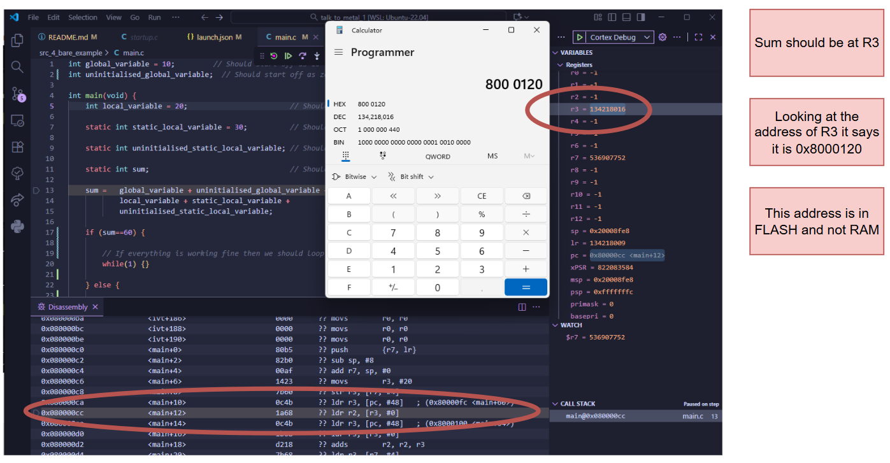
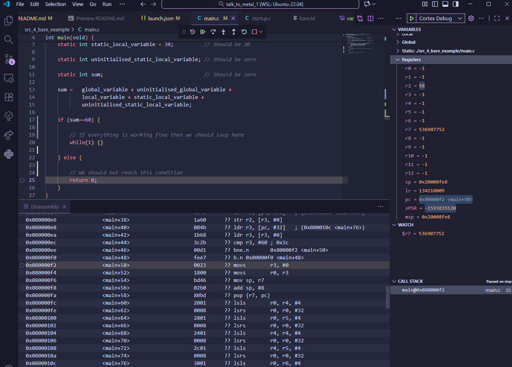
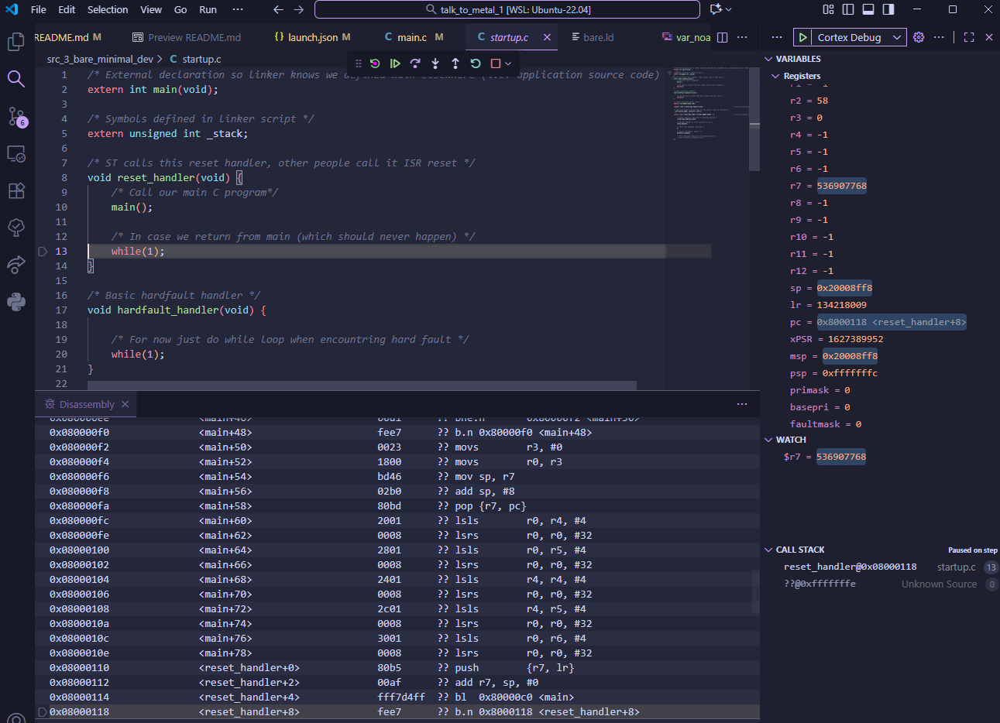

# 4 Bare Example
Some dumby variables to see how variable initialisation before main() occurs.

Compile:
```sh
 arm-none-eabi-gcc -mcpu=cortex-m0 -mthumb -std=c11 -g -O0 -c main.c -o main.o
 ```

 Link:
 ```sh
arm-none-eabi-gcc -nolibc -nostartfiles -T bare.ld main.o startup.o -o main.elf
 ```

 Stepping through the program we find that our variables are being stored into flash memory. In this case look at where our `sum` variable is:

 

We also see that we don't stay in main's infinite loop and instead return from it, leading us to go to the reset handler:



.

One thing to note that is unexpected is, I thought that I would end up in the hardfault handler instead since we end up executing a `str` instruction on a `flash` address.

This means we need to tell the linker to place these variables into `ram`.  

Before moving out, we look at the object dump `arm-none-eabi-objdump -D main.elf`:
```sh
Disassembly of section .data:

08000120 <global_variable>:
 8000120:       0000000a        andeq   r0, r0, sl

08000124 <static_local_variable.2>:
 8000124:       0000001e        andeq   r0, r0, lr, lsl r0

Disassembly of section .bss:

08000128 <uninitialised_global_variable>:
 8000128:       00000000        andeq   r0, r0, r0

0800012c <uninitialised_static_local_variable.1>:
 800012c:       00000000        andeq   r0, r0, r0

08000130 <sum.0>:
 8000130:       00000000        andeq   r0, r0, r0
 ```
We can see the variables, stored in the .data section of memory, is being placed at a flash memory address (`0x80000000`)