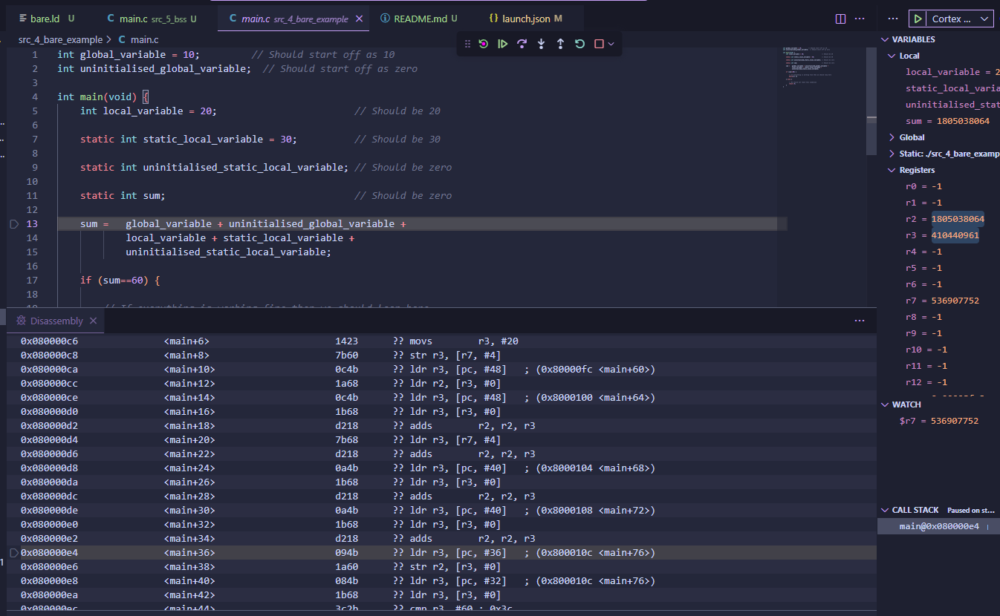

# 5 BSS
Place our initialise our variables and uninitialised variables (.data and .bss sections) into RAM.

We again do the linking process:
```sh
arm-none-eabi-gcc -nolibc -nostartfiles -T bare.ld main.o startup.o -o main.elf
```

Then we look at the object dump to see where our sections are now:
```sh
arm-none-eabi-objdump -D main.elf
```

Reveals to us:
```sh

Disassembly of section .data:

20000000 <global_variable>:
20000000:       0000000a        andeq   r0, r0, sl

20000004 <static_local_variable.2>:
20000004:       0000001e        andeq   r0, r0, lr, lsl r0

Disassembly of section .bss:

20000008 <uninitialised_global_variable>:
20000008:       00000000        andeq   r0, r0, r0

2000000c <uninitialised_static_local_variable.1>:
2000000c:       00000000        andeq   r0, r0, r0

20000010 <sum.0>:
20000010:       00000000        andeq   r0, r0, r0
```

Everyone is now in the RAM region (defined as the `0x20000000` area).

Given these changes we see our code is no longer trying to access flash memory during runtime, hence this should avoid a hard fault from triggering at the instruction that tries to store into flash. However since I didn't have that problem for some reason earlier, not much has changed other then now we can see the garbage variables showing up now that we are referencing RAM.



Next steps for us is to clean up RAM during startup so we don't have these garbage variables.